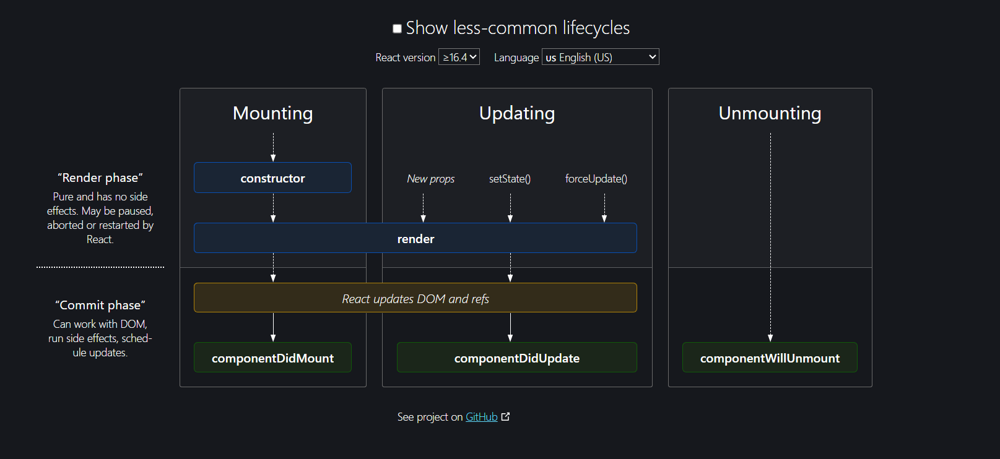

## React Class-Based Components and Lifecycle

### How are Class-Based Components Written

Class-based components in React are defined using ES6 class syntax. These components extend the `React.Component` class and must include a `render()` method, which returns the JSX that will be rendered in the UI.

#### Example: `CountClass` Component

```jsx
import React from "react";

class CountClass extends React.Component {
  constructor(props) {
    super(props);
    // Initializing state
    this.state = {
      count: 0,
      str: "Class based learning"
    };
    // Binding the handleClick method to the class instance
    this.handleClick = this.handleClick.bind(this);
  }

  // Method to handle click event
  handleClick() {
    this.setState(() => ({ count: this.state.count + 2 }));
    this.setState(() => ({ str: "Learning based on class" }));
  }

  // Render method to display the component
  render() {
    return (
      <>
        <h1>{this.props.name}</h1>
        <p>{this.props.count}</p>
        <h2>{this.state.count}</h2>
        <button onClick={this.handleClick}>Click me as usual</button>
        <p>{this.state.str}</p>
      </>
    );
  }
}

export default CountClass;
```

### Lifecycle of React Class-Based Components

React components go through a series of lifecycle methods. These methods are divided into three phases:

1. **Mounting**
2. **Updating**
3. **Unmounting**




#### Mounting Phase

This phase includes the following methods:

- **constructor(props)**: The constructor is called when a component is instantiated. It is used to initialize state and bind methods.
- **render()**: The render method is required in all class components. It returns the JSX that will be rendered in the UI.
- **componentDidMount()**: This method is called once, after the initial render. It is commonly used for making API calls to fetch data.

##### Example: Mounting Phase

```jsx
import React, { Component } from "react";

class Example extends Component {
  constructor(props) {
    super(props);
    this.state = { data: null };
  }

  componentDidMount() {
    fetch('https://api.example.com/data')
      .then(response => response.json())
      .then(data => this.setState({ data }));
  }

  render() {
    const { data } = this.state;
    return (
      <div>
        {data ? <p>{data}</p> : <p>Loading...</p>}
      </div>
    );
  }
}

export default Example;
```

#### Updating Phase

This phase includes the following methods:

- **render()**: Called again with updated state or props.
- **componentDidUpdate(prevProps, prevState)**: This method is called after the component’s updates are flushed to the DOM. It can be used to operate on the DOM when the component has been updated.

##### Example: Updating Phase

```jsx
import React, { Component } from "react";

class Example extends Component {
  constructor(props) {
    super(props);
    this.state = { count: 0 };
  }

  componentDidUpdate(prevProps, prevState) {
    if (prevState.count !== this.state.count) {
      console.log("Count updated!");
    }
  }

  increment = () => {
    this.setState({ count: this.state.count + 1 });
  }

  render() {
    return (
      <div>
        <p>{this.state.count}</p>
        <button onClick={this.increment}>Increment</button>
      </div>
    );
  }
}

export default Example;
```

#### Unmounting Phase

This phase includes the following method:

- **componentWillUnmount()**: This method is called right before a component is unmounted and destroyed. It is used to clean up resources such as timers or network requests.

##### Example: Unmounting Phase

```jsx
import React, { Component } from "react";

class Example extends Component {
  componentDidMount() {
    this.timer = setInterval(() => console.log('Tick'), 1000);
  }

  componentWillUnmount() {
    clearInterval(this.timer);
  }

  render() {
    return <div>Check the console</div>;
  }
}

export default Example;
```

### React Lifecycle with Example: `GithubId` Component

Let's dive deeper into the lifecycle of a class component using the `GithubId` component:

```jsx
import React, { Component } from "react";
import PropTypes from 'prop-types';

class GithubId extends Component {
  constructor(props) {
    super(props);
    this.state = {
      idData: null
    };
  }

  async componentDidMount() {
    const { username } = this.props;
    try {
      let response = await fetch(`https://api.github.com/users/${username}`);
      if (!response.ok) {
        throw new Error('Network response was not ok');
      }
      let userId = await response.json();

      this.setState({
        idData: userId
      });
    } catch (error) {
      console.error('There has been a problem with your fetch operation:', error);
    }
  }

  render() {
    const { idData } = this.state;

    if (idData === null) {
      return <h1>Profile loading.....please wait</h1>;
    }

    const { name, bio, avatar_url } = idData;

    return (
      <>
        <div className="header">
          <h1>{name}</h1>
          
        </div>
        <div className="body">
          <h2>{bio}</h2>
        </div>
      </>
    );
  }
}

GithubId.propTypes = {
  username: PropTypes.string.isRequired
};

export default GithubId;
```

#### Breakdown of `GithubId` Component Lifecycle

1. **Constructor**
   - Initializes the state with `idData` set to `null`.

2. **Render (Initial)**
   - Displays a loading message since `idData` is `null`.

3. **componentDidMount**
   - Fetches data from the GitHub API.
   - Updates the state with the fetched data using `setState`.

4. **Render (After State Update)**
   - Renders the fetched data (name, bio, avatar) once the state is updated.

### Parent and Child Components Lifecycle

If you have a parent component that calls multiple instances of a child component, the lifecycle methods are called in the following order:

1. **Parent Constructor**
2. **Parent Render**
3. **First Child Constructor**
4. **First Child Render**
5. **Second Child Constructor**
6. **Second Child Render**
7. **First Child componentDidMount**
8. **Second Child componentDidMount**
9. **Parent componentDidMount**

This order ensures that all child components are constructed and rendered before the parent component completes its `componentDidMount` method.

### Example with Parent and Child Components

```jsx
import React, { Component } from "react";

class Child extends Component {
  constructor(props) {
    super(props);
    console.log(`${props.name} constructor`);
  }

  componentDidMount() {
    console.log(`${this.props.name} componentDidMount`);
  }

  render() {
    console.log(`${this.props.name} render`);
    return <div>{this.props.name}</div>;
  }
}

class Parent extends Component {
  constructor(props) {
    super(props);
    console.log("Parent constructor");
  }

  componentDidMount() {
    console.log("Parent componentDidMount");
  }

  render() {
    console.log("Parent render");
    return (
      <div>
        <Child name="First Child" />
        <Child name="Second Child" />
      </div>
    );
  }
}

export default Parent;
```

### Key Points

- **Mounting**: Constructor, initial render, componentDidMount.
- **Updating**: State/props change triggers re-render, componentDidUpdate.
- **Unmounting**: Cleanup with componentWillUnmount.
- **Parent-Child Order**: Parent methods wrap around child methods, ensuring a structured and predictable lifecycle.